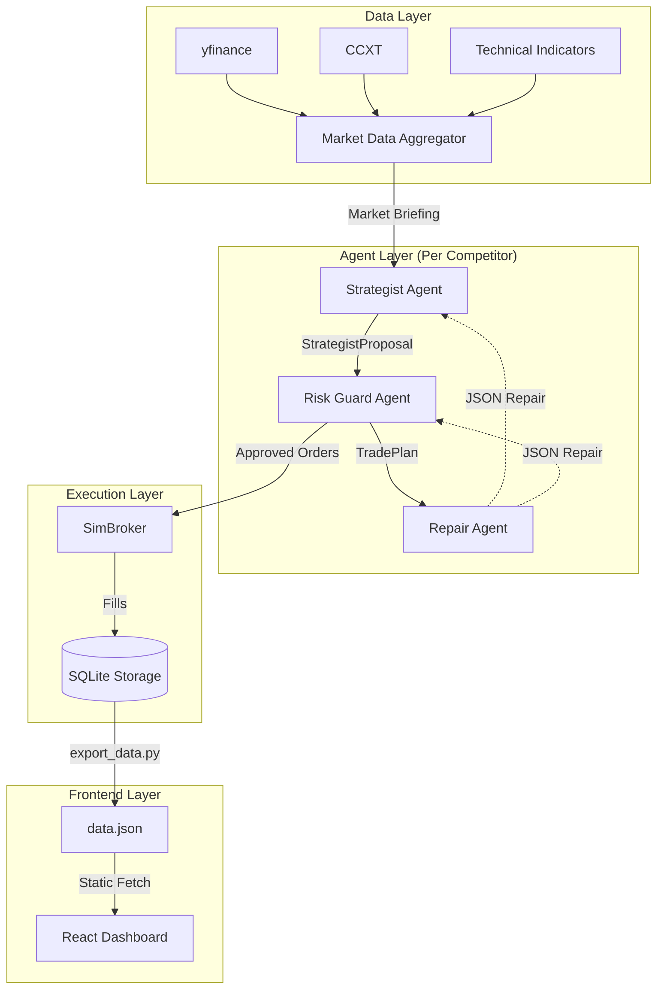

# LLMTradingAgents

**Multi-Agent LLM Trading Arena**

[](https://www.python.org/downloads/)

---

## System Architecture

LLMTradingAgents is an automated trading system that orchestrates competition between different Large Language Models (LLMs). It uses a 3-agent architecture to analyze market data, propose trades, and validate risk.



## Core Components

### 1. Market Data Aggregator
The system fetches authoritative data from multiple sources to build a comprehensive `MarketBriefing` for each ticker:
- **Price History**: OHLCV data via `yfinance` (Equities) and `ccxt` (Crypto).
- **Technical Indicators**: Deterministic computation of RSI (14), MACD, Moving Averages (20/50), and Volatility.
- **Fundamentals**: SEC filing data (P/E, EPS, Margins) via `yfinance`.
- **Alternative Data**: Earnings calendars, Insider transactions, and News sentiment.

### 2. The 3-Agent System
Each trading session involves a coordinated workflow between three specialized agents:

#### Agent A: The Strategist
- **Role**: Senior Trading Analyst.
- **Input**: Comprehensive `MarketBriefing` (Technicals + Fundamentals + News).
- **Output**: `StrategistProposal` (JSON).
- **Logic**: Analyzes multi-modal data to generate BUY/SELL/HOLD signals with confidence scores (0.0-1.0) and rationales.

#### Agent B: The Risk Guard
- **Role**: Portfolio Risk Manager.
- **Input**: `StrategistProposal` + Current Portfolio Snapshot.
- **Output**: `TradePlan` (JSON).
- **Logic**: Validates proposals against strict constraints:
    - **Cash Availability**: Ensures sufficient buying power.
    - **Position Limits**: Enforces max position size (e.g., 25% of equity).
    - **Short Selling**: Blocks short selling (Long-only MVP).
    - **Hallucinations**: Vetoes tickers not in the approved universe.

#### Agent C: The Repair Agent
- **Role**: JSON Validator & Fixer.
- **Trigger**: Activated when Agent A or B outputs malformed JSON.
- **Logic**: Uses a specialized prompt to correct syntax errors while preserving the original intent.

### 3. Simulation Engine
- **SimBroker**: A local virtual broker that manages cash, positions, and order execution.
- **Execution**: Supports MARKET orders with configurable slippage (bps) and transaction fees (bps).
- **Persistence**: State is persisted in `arena.db` (SQLite).

## Frontend & Deployment

The dashboard is a **Static Single Page Application (SPA)** built with **React 19**, **Vite**, and **Tailwind CSS v4**.

### Architecture
- **Serverless**: The frontend does not require a running backend server.
- **Data Source**: It consumes a static `data.json` file generated by the backend.
- **Deployment Pipeline**:
    1.  **GitHub Actions**: Runs the trading session (Python).
    2.  **Data Export**: Scripts generate `frontend/public/data.json`.
    3.  **Commit**: The workflow commits the updated data file to the repo.
    4.  **Vercel/Netlify**: Detects the commit and automatically redeploys the frontend.

### Local Development

```bash
cd frontend
npm install
npm run dev
```

## Installation

### Prerequisites
- Python 3.10+
- Node.js 18+ (for frontend)

### Setup

1.  **Configure Environment**:
    ```bash
    cp .env.example .env
    # Add your OPENROUTER_API_KEY and GOOGLE_API_KEY
    ```

2.  **Initialize Database**:
    ```bash
    python -m myllmtradingagents.cli init-db --config config/arena.example.yaml
    ```

## Usage

### Running a Session

The CLI entrypoint handles all trading operations.

```bash
# Run a live trading session (OPEN or CLOSE)
python -m myllmtradingagents.cli run --config config/arena.example.yaml --session OPEN

# Run a dry-run (no trades executed, no DB writes)
python -m myllmtradingagents.cli run --config config/arena.example.yaml --session OPEN --dry-run
```

### Manual Data Export

To update the frontend data manually:

```bash
python scripts/export_data.py --db arena.db --output frontend/public/data.json
```

## Configuration

The system is highly configurable via YAML. See `config/arena.example.yaml`.

```yaml
competitors:
  - id: gemini_flash
    provider: gemini
    model: "gemini-1.5-flash"
    max_position_pct: 0.25

simulation:
  initial_cash: 100000
  slippage_bps: 10
  fee_bps: 10
```
